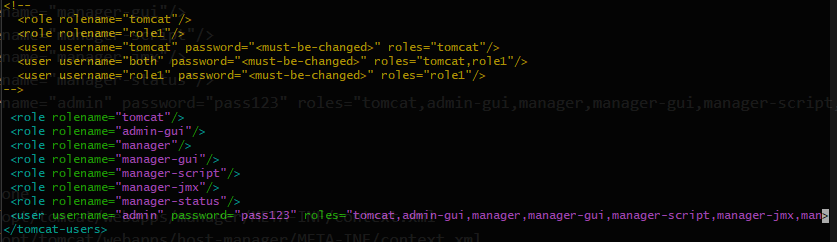
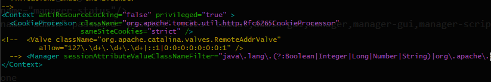

### Allow ssh and update

```shell
sudo ufw allow ssh
sudo apt update
```

### Java 17 install and set $JAVA_HOME
```shell
sudo apt-get install openjdk-17-jdk
sudo update-java-alternatives --list
sudo update-java-alternatives --set java-1.17.0-openjdk-amd64
java -version
export JAVA_HOME=/usr/lib/jvm/java-17-openjdk-amd64
echo $JAVA_HOME
```

### tomcat install
```shell
sudo groupadd tomcat
sudo useradd -s /bin/false -g tomcat -d /opt/tomcat tomcat
cd /tmp
wget https://dlcdn.apache.org/tomcat/tomcat-10/v10.1.13/bin/apache-tomcat-10.1.13.tar.gz
sudo mkdir /opt/tomcat
cd /opt/tomcat
sudo tar xzvf /tmp/apache-tomcat-10.*tar.gz -C /opt/tomcat --strip-components=1
sudo chown -R tomcat:tomcat /opt/tomcat
sudo chmod -R u+x /opt/tomcat/bin
sudo chown -R tomcat webapps/ work/ temp/ logs/
```

### tomcat configure

```shell
sudo nano /etc/systemd/system/tomcat.service
```
- copy paste config below:
 
```text
[Unit]
Description=Apache Tomcat Web Application Container
After=network.target

[Service]
Type=forking
WorkingDirectory=/opt/tomcat/webapps

Environment=JAVA_HOME=/usr/lib/jvm/java-17-openjdk-amd64
Environment=CATALINA_PID=/opt/tomcat/temp/tomcat.pid
Environment=CATALINA_HOME=/opt/tomcat
Environment=CATALINA_BASE=/opt/tomcat
Environment=CATALINA_OPTS=-Xms512M -Xmx1024M -server -XX:+UseParallelGC
Environment=JAVA_OPTS=-Djava.awt.headless=true -Djava.security.egd=file:/dev/v/urandom

ExecStart=/opt/tomcat/bin/startup.sh
ExecStop=/opt/tomcat/bin/shutdown.sh

User=tomcat
Group=tomcat
UMask=0007
RestartSec=10
Restart=always

[Install]
WantedBy=multi-user.target
```

```shell
sudo systemctl daemon-reload
sudo systemctl start tomcat
sudo systemctl status tomcat
sudo systemctl enable tomcat
sudo ufw allow 8080
```

### Add user to tomcat
```shell
sudo nano /opt/tomcat/conf/tomcat-users.xml
```
- copy paste config below:



```text
 <role rolename="tomcat"/>
 <role rolename="admin-gui"/>
 <role rolename="manager"/>
 <role rolename="manager-gui"/>
 <role rolename="manager-script"/>
 <role rolename="manager-jmx"/>
 <role rolename="manager-status"/>
 <user username="admin" password="pass123" roles="tomcat,admin-gui,manager,manager-gui,manager-script,manager-jmx,manager-status"/>
```

### Allow access for each one

- `<Valve className="org.apache.catalina.valves.RemoteAddrValve" allow="^.*$" />` comment it using `<!-- <something>  -->`

```shell
sudo nano /opt/tomcat/webapps/manager/META-INF/context.xml
sudo nano /opt/tomcat/webapps/host-manager/META-INF/context.xml
```




### Restart tomcat
```shell
sudo systemctl daemon-reload
sudo systemctl restart tomcat
```


