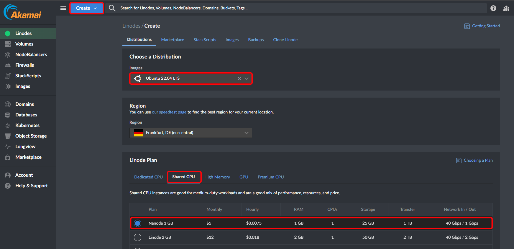
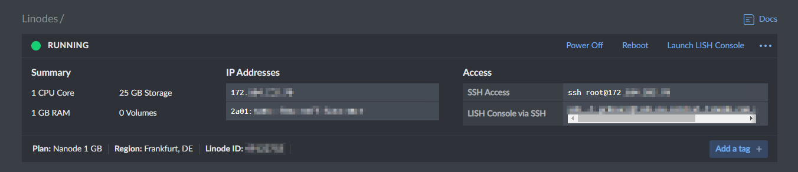
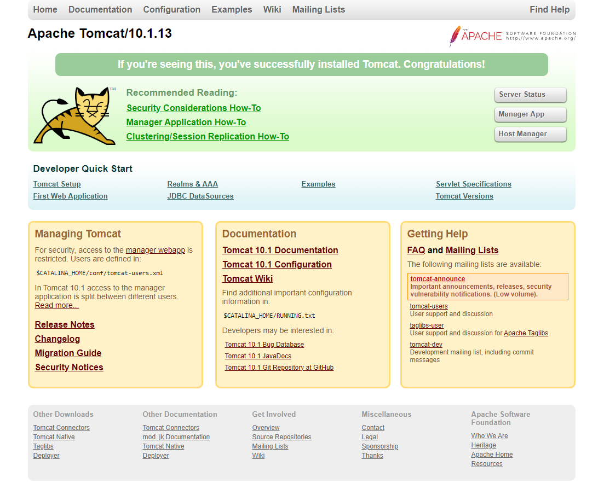
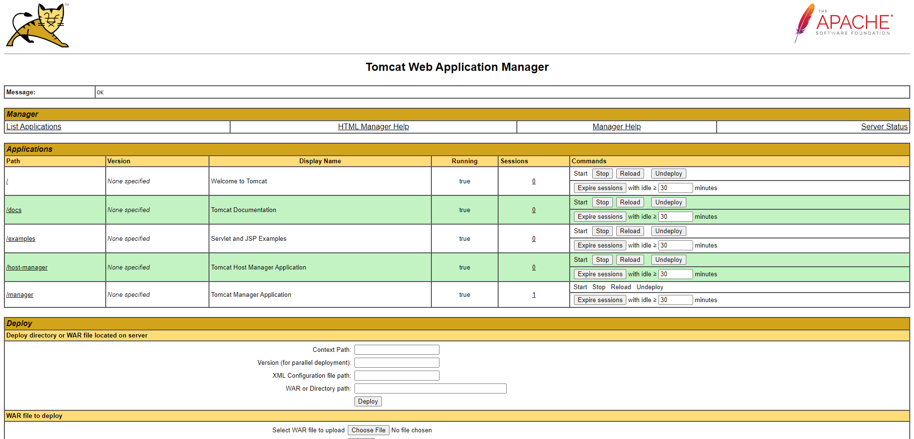
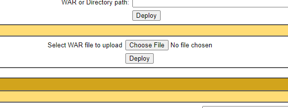
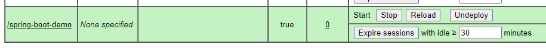
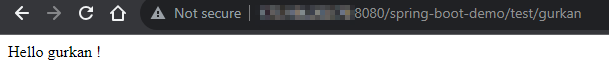

### Medium Link : [https://medium.com/@gurkanucar/tomcat10-spring-boot-3-java-17-deployment-on-ubuntu-server-a3420c4f431f](https://medium.com/@gurkanucar/tomcat10-spring-boot-3-java-17-deployment-on-ubuntu-server-a3420c4f431f)

### Create a ubuntu server from linode





### connect to your server over ssh

```shell
ssh root@<IP_ADDRESS>
```

### Allow ssh and update

```shell
sudo ufw allow ssh
sudo apt update
```

### Java 17 install and set $JAVA_HOME
```shell
sudo apt-get install openjdk-17-jdk
sudo update-java-alternatives --list
sudo update-java-alternatives --set java-1.17.0-openjdk-amd64
java -version
export JAVA_HOME=/usr/lib/jvm/java-17-openjdk-amd64
echo $JAVA_HOME
```

### tomcat install
```shell
sudo groupadd tomcat
sudo useradd -s /bin/false -g tomcat -d /opt/tomcat tomcat
cd /tmp
wget https://dlcdn.apache.org/tomcat/tomcat-10/v10.1.13/bin/apache-tomcat-10.1.13.tar.gz
sudo mkdir /opt/tomcat
cd /opt/tomcat
sudo tar xzvf /tmp/apache-tomcat-10.*tar.gz -C /opt/tomcat --strip-components=1
sudo chown -R tomcat:tomcat /opt/tomcat
sudo chmod -R u+x /opt/tomcat/bin
sudo chown -R tomcat webapps/ work/ temp/ logs/
```

### tomcat configure

```shell
sudo nano /etc/systemd/system/tomcat.service
```
- copy paste config below:
 
```text
[Unit]
Description=Apache Tomcat Web Application Container
After=network.target

[Service]
Type=forking
WorkingDirectory=/opt/tomcat/webapps

Environment=JAVA_HOME=/usr/lib/jvm/java-17-openjdk-amd64
Environment=CATALINA_PID=/opt/tomcat/temp/tomcat.pid
Environment=CATALINA_HOME=/opt/tomcat
Environment=CATALINA_BASE=/opt/tomcat
Environment=CATALINA_OPTS=-Xms512M -Xmx1024M -server -XX:+UseParallelGC
Environment=JAVA_OPTS=-Djava.awt.headless=true -Djava.security.egd=file:/dev/v/urandom

ExecStart=/opt/tomcat/bin/startup.sh
ExecStop=/opt/tomcat/bin/shutdown.sh

User=tomcat
Group=tomcat
UMask=0007
RestartSec=10
Restart=always

[Install]
WantedBy=multi-user.target
```

### start tomcat

```shell
sudo systemctl daemon-reload
sudo systemctl start tomcat
sudo systemctl status tomcat
sudo systemctl enable tomcat
sudo ufw allow 8080
```





### Add user to tomcat
```shell
sudo nano /opt/tomcat/conf/tomcat-users.xml
```
- copy paste config below:


```text
 <role rolename="tomcat"/>
 <role rolename="admin-gui"/>
 <role rolename="manager"/>
 <role rolename="manager-gui"/>
 <role rolename="manager-script"/>
 <role rolename="manager-jmx"/>
 <role rolename="manager-status"/>
 <user username="admin" password="pass123" roles="tomcat,admin-gui,manager,manager-gui,manager-script,manager-jmx,manager-status"/>
```

### Allow access for each one

- `<Valve className="org.apache.catalina.valves.RemoteAddrValve" allow="^.*$" />` comment it using `<!-- <something>  -->`

```shell
sudo nano /opt/tomcat/webapps/manager/META-INF/context.xml
sudo nano /opt/tomcat/webapps/host-manager/META-INF/context.xml
```


### Restart tomcat
```shell
sudo systemctl daemon-reload
sudo systemctl restart tomcat
```




### !IMPORTANT - Deploy Java 17 Spring-Boot 3.1 Application

#### 1 -  To deploy our spring boot application we have to extend `SpringBootServletInitializer`. Extending it in Spring Boot allows the application to be deployed as a WAR on external servlet containers.

```java
@SpringBootApplication
public class SpringBootDemoApplication extends SpringBootServletInitializer {

  public static void main(String[] args) {
    SpringApplication.run(SpringBootDemoApplication.class, args);
  }
}

```

#### 2 - Update packaging type to `war` and specify build final name.

```xml
    <name>spring-boot-demo</name>
    <description>spring-boot-demo</description>
    <!-- here -->
    <packaging>war</packaging>
    <properties>
        <java.version>17</java.version>
    </properties>

    ..........
    
    <build>
        <finalName>spring-boot-demo</finalName>
        <plugins>
    .........
```

#### 3 - Run the following command to build your project:

```shell
mvn clean package
```

#### 4 - Open tomcat manager `<IP>:8080/manager/html` and deploy your war file 




# Congrats!






### resources

- https://phoenixnap.com/kb/install-tomcat-ubuntu
